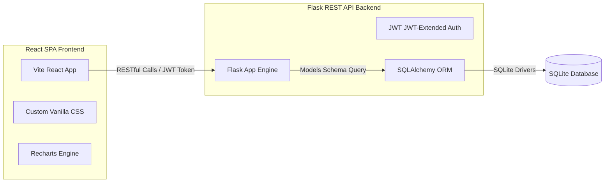

# WorkFlow Pro – Task & Project Management System

**WorkFlow Pro** is a professional-grade internal enterprise application built for managing software development teams, projects, department allocations, task boards, and analytical reporting. This application is structured specifically to showcase modern web development practices for university CSE evaluations.

---

## Technical Stack & Architecture

The project maintains a strict separation of concerns between its frontend and backend components.



### Backend (Python 3 / Flask)
* **Flask Framework**: Lightweight REST API endpoints.
* **SQLAlchemy ORM**: Object Relational Mapping with strict foreign keys, cascade deletes, and relationships.
* **Flask-JWT-Extended**: Secure, stateless user login session token management.
* **SQLite**: Embedded database file.

### Frontend (React / JavaScript)
* **Vite SPA**: Super-fast React runtime environment.
* **Recharts**: Data visualization for project progression metrics, workloads, and task distributions.
* **Lucide React**: Clean vector-styled iconography.
* **Vanilla CSS Variables**: Tailored themes avoiding Tailwind dependencies.

---

## Directory Structure

```text
/project-root
│
├── /backend
│   ├── /app
│   │   ├── __init__.py           # Flask factory & blueprint router configs
│   │   ├── models.py             # SQLAlchemy schemas (User, Employee, Task, etc.)
│   │   ├── /routes
│   │   │   ├── auth.py           # Login, JWT retrieval, and profile updates
│   │   │   ├── dashboard.py      # Quick stat metrics for Admin and Employees
│   │   │   ├── departments.py    # Division CRUD routes
│   │   │   ├── employees.py      # Staff directory management routes
│   │   │   ├── projects.py       # Workspace projects allocations
│   │   │   ├── tasks.py          # Kanban task boards, comments, and logs
│   │   │   └── reports.py        # Analytics data compilations
│   │   └── /utils
│   │       └── auth_helpers.py   # Admin decorator checkers
│   │
│   ├── /tests
│   │   └── test_workflow.py      # Pytest automated workflow tests
│   │
│   ├── config.py                 # Key variables & DB file links
│   ├── requirements.txt          # Python packages list
│   ├── run.py                    # App entry script
│   └── seed.py                   # DB drop/create and test seeding script
│
├── /frontend
│   ├── /src
│   │   ├── /components
│   │   │   ├── Navbar.jsx        # Current page context header
│   │   │   └── Sidebar.jsx       # Dynamic sidebar navigations
│   │   ├── /context
│   │   │   └── AppContext.jsx    # Global authentication & Toast notifications
│   │   ├── /pages
│   │   │   ├── Dashboard.jsx     # Visual data dashboards
│   │   │   ├── Login.jsx         # Credentials portals
│   │   │   ├── ProjectsList.jsx  # Project cards list and assignment modals
│   │   │   ├── TaskList.jsx      # Kanban boards with comments and logs
│   │   │   ├── EmployeesList.jsx # Staff spreadsheets list (Admin)
│   │   │   ├── DepartmentsList.jsx# Divisions listings (Admin)
│   │   │   ├── Reports.jsx       # Analytics graphs (Admin)
│   │   │   └── Profile.jsx       # Personal user settings
│   │   ├── /services
│   │   │   └── api.js            # Intercepting fetch REST client
│   │   ├── App.jsx               # Protected routing mapper
│   │   ├── index.css             # System-wide typography & color styles
│   │   └── main.jsx              # React DOM mounting
│   ├── package.json              # React dependencies
│   └── vite.config.js            # Vite build rules
│
└── README.md                     # Documentation
```

---

## Database Schemas

The database structure features 7 tables maintaining relational integrity:

1. **Users**: Identifies system usernames, emails, roles (`admin` or `employee`), and passwords.
2. **Departments**: Tracks corporate divisions and descriptions.
3. **Employees**: Staff profiles containing salary figures, hire dates, job titles, linked directly in a one-to-one fashion with `Users`.
4. **Projects**: Contains timeline durations, statuses (`planning`, `active`, `completed`), and progress percentages.
5. **ProjectMembers**: Association mapping table handling many-to-many linkages between projects and employees.
6. **Tasks**: Trackable task cards containing deadlines, priorities (`low`, `medium`, `high`), status columns (`pending`, `in_progress`, `completed`), assigned employee FKs, and project FKs.
7. **TaskComments**: User conversations attached directly to specific task entities.
8. **TaskHistory**: Automatic audit logger capturing metadata modifications, status transformations, and user assignments.

---

## Setup & Running Instructions

### 1. Run Backend server
From the `/project-root` folder:

```bash
# Create a python virtual environment
python3 -m venv venv

# Activate virtual environment
source venv/bin/activate

# Upgrade pip and install libraries
pip install --upgrade pip
pip install -r backend/requirements.txt

# Initialise database and seed mock data
python3 backend/seed.py

# Launch backend API service (runs on http://localhost:5001)
python3 backend/run.py
```

### 2. Run Frontend client
From the `/project-root/frontend` folder in a new terminal window:

```bash
# Install node packages
npm install

# Start React hot development server (runs on http://localhost:5173)
npm run dev
```

---

## Verification & Testing

To run the automated suite testing authentication, salary privacy controls, task overdue checks, and auto-calculating project percentages:

Ensure virtual environment is active in the root folder, then run:
```bash
PYTHONPATH=. pytest backend/tests/
```

---

## Demo Login Credentials

The application seeds default accounts for demonstration:

* **Administrator**:
  * Username: `admin`
  * Password: `admin123`
* **Employee (Senior Developer)**:
  * Username: `lalit_dev`
  * Password: `password123`
* **Employee (Product Manager)**:
  * Username: `anshu_pm`
  * Password: `password123`
* **Employee (QA Engineer)**:
  * Username: `kunal_qa`
  * Password: `password123`
